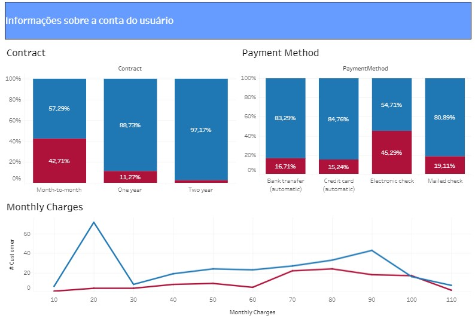

Em 2020, durante a minha passagem pelo iFood, tive meu primeiro contato de maneira mais profunda com o Tableau, onde tive a oportunidade de desenvolver um dashboard para acompanhamento de leads.

Para dar continuidade ao meu aprendizado, criei um dashboard utilizando o tableau public (versão desktop gratuita), dessa vez com dados de churn. Caso tenha interesse em reproduzir as visualizações, você pode encontrar os dados que estão disponíveis na plataforma do kaggle [aqui](https://www.kaggle.com/blastchar/telco-customer-churn).

Caso tenha interesse em visualizar o dashboard completo, basta acessar: [Telcom Customer - Churn](https://public.tableau.com/app/profile/rodrigotributino/viz/TelcomCostumer-Churn/Painel1)

Abaixo uma demonstração do dash.

